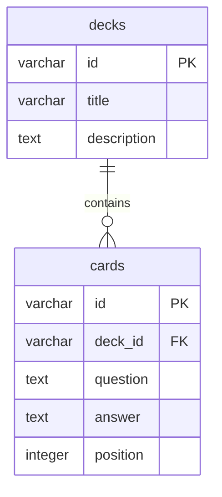

# Проектирование базы данных IKNA Cards

## Тематика проекта

IKNA Cards - учебное веб-приложение для повторения материала с помощью карточек. Пользователь открывает учебную колоду, видит карточку с вопросом, проверяет ответ и переходит к следующей карточке.

В рамках учебного проекта для хранения данных достаточно двух основных таблиц:

- `decks` - учебные колоды;
- `cards` - карточки, входящие в колоды.

## Таблицы

### decks

Таблица хранит общую информацию об учебной колоде.

| Поле | Тип данных | Ограничения | Назначение |
| --- | --- | --- | --- |
| id | VARCHAR(80) | PRIMARY KEY | Уникальный идентификатор колоды |
| title | VARCHAR(160) | NOT NULL | Название колоды |
| description | TEXT | NOT NULL | Описание колоды |

Пример записи:

| id | title | description |
| --- | --- | --- |
| js-basics | Основы JavaScript | Базовые определения языка JavaScript для интервального повторения. |

### cards

Таблица хранит карточки с вопросами и ответами.

| Поле | Тип данных | Ограничения | Назначение |
| --- | --- | --- | --- |
| id | VARCHAR(40) | PRIMARY KEY | Уникальный идентификатор карточки |
| deck_id | VARCHAR(80) | NOT NULL, FOREIGN KEY decks(id), ON DELETE CASCADE | Колода, к которой относится карточка |
| question | TEXT | NOT NULL | Текст вопроса |
| answer | TEXT | NOT NULL | Текст ответа |
| position | INTEGER | NOT NULL, CHECK > 0 | Порядковый номер карточки в колоде |

Пример записи:

| id | deck_id | question | answer | position |
| --- | --- | --- | --- | --- |
| js-001 | js-basics | Что такое JavaScript? | JavaScript - это язык программирования... | 1 |

## Первичные и внешние ключи

| Таблица | Первичный ключ | Внешний ключ |
| --- | --- | --- |
| decks | id | - |
| cards | id | deck_id ссылается на decks(id) |

## Связи между таблицами

Связь между таблицами `decks` и `cards` имеет тип 1:N.

Одна колода может содержать много карточек, но каждая карточка относится только к одной колоде.

При удалении колоды все связанные с ней карточки удаляются автоматически за счет правила `ON DELETE CASCADE`.

## ER-диаграмма

